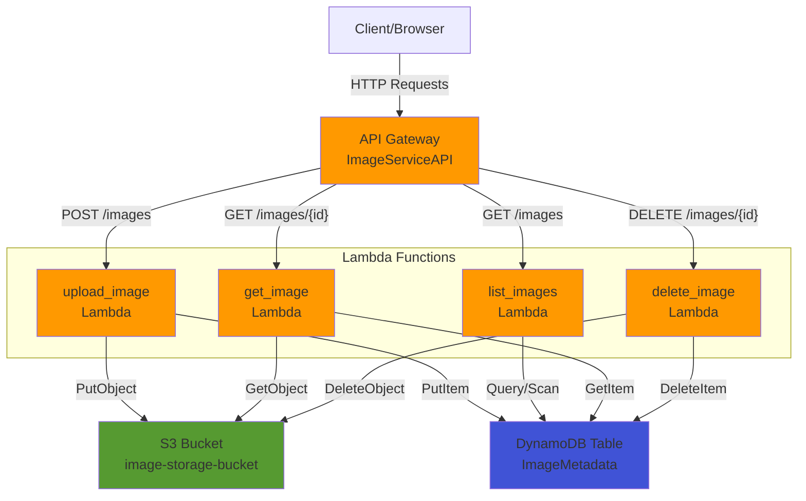
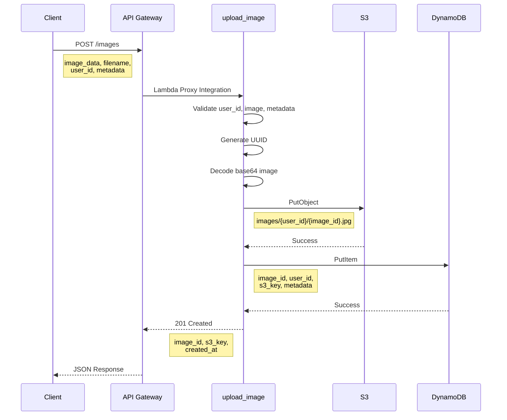
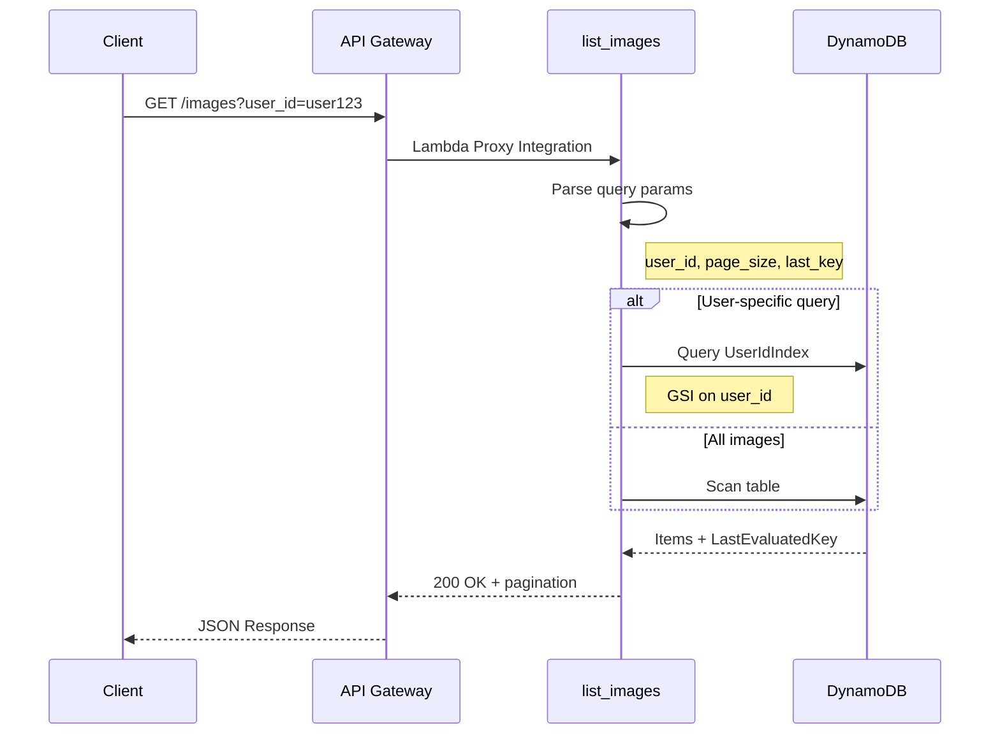
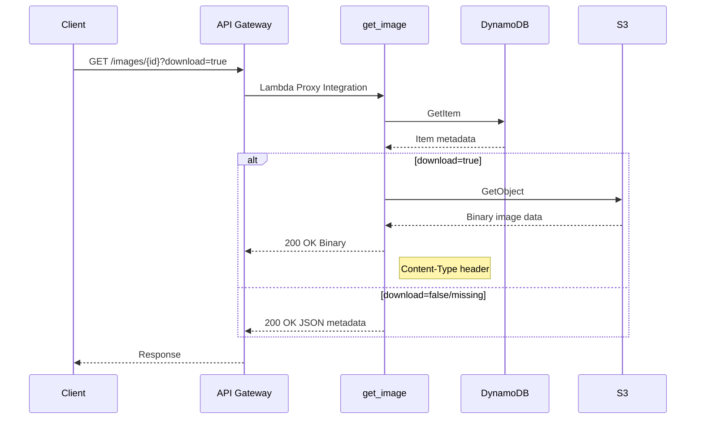
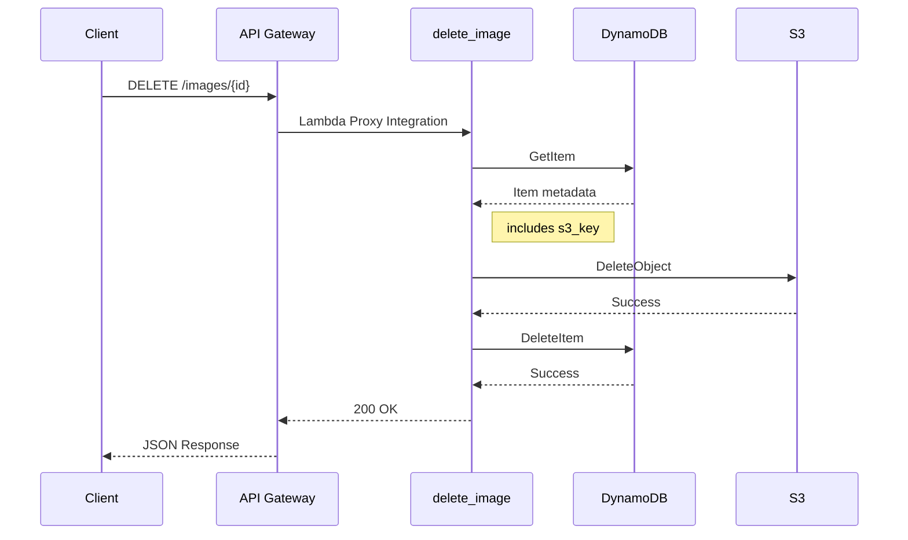
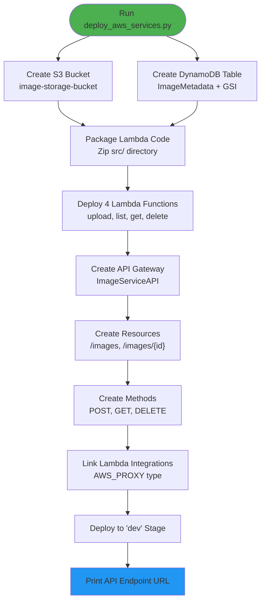
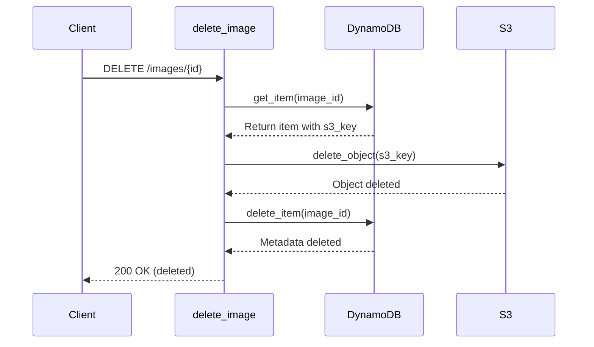

# Serverless Image API - Architecture Analysis & API Gateway Comparison

## 🏗️ Part 1: Codebase Architecture Analysis

### Overview

This is a **serverless image management API** built on AWS services with LocalStack for local development. The application enables users to upload, retrieve, list, and delete images with associated metadata.

**Core Services:**
- **Amazon S3**: Binary image storage
- **Amazon DynamoDB**: Image metadata storage with GSI for user-based queries
- **AWS Lambda**: Serverless compute for business logic
- **Amazon API Gateway**: RESTful API endpoint management

---

## 📊 Architecture Diagram



---

## 🔄 Service Interconnections & Data Flow

### 1. **Upload Image Flow** (POST /images)



**Key Components:**
- [upload_image.py](file:///c:/Users/ashwi/projects/monty/repo/serverless-image-api/src/handlers/upload_image.py#L16-L139): Validates input, stores binary in S3, saves metadata to DynamoDB
- **Validation**: File extension, size, user_id format, metadata structure
- **Storage Pattern**: `images/{user_id}/{image_id}.{extension}`

---

### 2. **List Images Flow** (GET /images)



**Key Components:**
- [list_images.py](file:///c:/Users/ashwi/projects/monty/repo/serverless-image-api/src/handlers/list_images.py): Queries DynamoDB with pagination support
- **Global Secondary Index**: `UserIdIndex` for efficient user-based queries
- **Pagination**: Supports cursor-based pagination with `last_key`

---

### 3. **Get/Download Image Flow** (GET /images/{image_id})



**Key Components:**
- [get_image.py](file:///c:/Users/ashwi/projects/monty/repo/serverless-image-api/src/handlers/get_image.py): Dual-mode response (metadata vs binary)
- **Binary Support**: Uses `isBase64Encoded: true` for image downloads
- **Query Parameter**: `download=true` switches response mode

---

### 4. **Delete Image Flow** (DELETE /images/{image_id})



**Key Components:**
- [delete_image.py](file:///c:/Users/ashwi/projects/monty/repo/serverless-image-api/src/handlers/delete_image.py): Atomic deletion from both S3 and DynamoDB
- **Two-phase Cleanup**: Retrieves metadata first to get S3 key, then deletes from both services

---

## 🛠️ Key Infrastructure Components

### Configuration Layer
- [config.py](file:///c:/Users/ashwi/projects/monty/repo/serverless-image-api/src/config.py): Centralized environment variables and constants
  - Service endpoints (LocalStack vs AWS)
  - Resource names (bucket, table)
  - Business rules (max file size, allowed extensions)

### AWS Client Factory
- [aws_clients.py](file:///c:/Users/ashwi/projects/monty/repo/serverless-image-api/src/utils/aws_clients.py): Environment-aware client creation
  - Detects LocalStack vs production environment
  - Provides `get_s3_client()`, `get_dynamodb_resource()`, `get_dynamodb_client()`
  - Automatically configures endpoints and credentials

### Shared Utilities
- [validators.py](file:///c:/Users/ashwi/projects/monty/repo/serverless-image-api/src/utils/validators.py): Input validation logic
- [response_helpers.py](file:///c:/Users/ashwi/projects/monty/repo/serverless-image-api/src/utils/response_helpers.py): Standardized API Gateway responses

---

## 🐳 LocalStack Setup

### Docker Compose Configuration
[docker-compose.yml](file:///c:/Users/ashwi/projects/monty/repo/serverless-image-api/docker-compose.yml) defines:

```yaml
services:
  localstack:
    image: localstack/localstack:latest
    ports:
      - "4566:4566"  # Main gateway port
    environment:
      - SERVICES=s3,dynamodb,lambda,apigateway,iam,logs,cloudwatch
      - LAMBDA_EXECUTOR=docker
      - PERSISTENCE=1  # Data persists across restarts
    volumes:
      - ./localstack_data:/var/lib/localstack  # Persistent storage
```

**Benefits:**
- Complete AWS emulation locally
- No cloud costs during development
- Fast iteration cycles
- Network isolation with custom bridge network

---

## 🚀 Part 2: API Gateway - Console vs Programmatic Comparison

The AWS tutorial demonstrates manual console-based setup. This codebase achieves the **same results programmatically** using the AWS SDK (boto3).

### Comparison Table

| AWS Console Step | Codebase Programmatic Implementation | File Reference |
|-----------------|-------------------------------------|----------------|
| **Step 1: Create Lambda Function** | Creates 4 Lambda functions with code from zip | [deploy_aws_services.py:L112-158](file:///c:/Users/ashwi/projects/monty/repo/serverless-image-api/scripts/deploy_aws_services.py#L112-L158) |
| **Step 2: Create REST API** | `apigateway.create_rest_api()` | [deploy_aws_services.py:L170-174](file:///c:/Users/ashwi/projects/monty/repo/serverless-image-api/scripts/deploy_aws_services.py#L170-L174) |
| **Step 3: Create Resources** | `apigateway.create_resource()` for `/images` and `/{image_id}` | [deploy_aws_services.py:L183-204](file:///c:/Users/ashwi/projects/monty/repo/serverless-image-api/scripts/deploy_aws_services.py#L183-L204) |
| **Step 3: Create Methods** | `apigateway.put_method()` for POST, GET, DELETE | [deploy_aws_services.py:L220-225](file:///c:/Users/ashwi/projects/monty/repo/serverless-image-api/scripts/deploy_aws_services.py#L220-L225) |
| **Step 3: Lambda Proxy Integration** | `apigateway.put_integration()` with `type='AWS_PROXY'` | [deploy_aws_services.py:L229-236](file:///c:/Users/ashwi/projects/monty/repo/serverless-image-api/scripts/deploy_aws_services.py#L229-L236) |
| **Step 4: Deploy API** | `apigateway.create_deployment()` to 'dev' stage | [deploy_aws_services.py:L258-262](file:///c:/Users/ashwi/projects/monty/repo/serverless-image-api/scripts/deploy_aws_services.py#L258-L262) |
| **Step 5: Invoke API** | Returns constructed endpoint URL | [deploy_aws_services.py:L266](file:///c:/Users/ashwi/projects/monty/repo/serverless-image-api/scripts/deploy_aws_services.py#L266) |

---

## 📋 Detailed Step-by-Step Comparison

### AWS Console: Step 1 - Create Lambda Function

**Manual Console Actions:**
1. Navigate to Lambda console
2. Click "Create function"
3. Enter function name: `my-function`
4. Select runtime: Node.js
5. Click "Create function"

**Codebase Programmatic Equivalent:**

```python
# From deploy_aws_services.py lines 112-158
def create_lambda_functions(zip_file):
    client = get_client('lambda')
    
    with open(zip_file, 'rb') as f:
        code_content = f.read()
    
    functions = [
        {'name': 'upload_image', 'handler': 'handlers.upload_image.upload_image'},
        {'name': 'list_images', 'handler': 'handlers.list_images.list_images'},
        {'name': 'get_image', 'handler': 'handlers.get_image.get_image'},
        {'name': 'delete_image', 'handler': 'handlers.delete_image.delete_image'},
    ]
    
    for func in functions:
        response = client.create_function(
            FunctionName=func['name'],
            Runtime='python3.9',
            Role=LAMBDA_ROLE_ARN,
            Handler=func['handler'],
            Code={'ZipFile': code_content},
            Environment={
                'Variables': {
                    'S3_BUCKET_NAME': S3_BUCKET_NAME,
                    'DYNAMODB_TABLE_NAME': DYNAMODB_TABLE_NAME,
                    'LOCALSTACK_ENDPOINT': 'http://localstack:4566',
                    'AWS_REGION': AWS_REGION,
                    'STAGE': 'dev'
                }
            },
            Timeout=30
        )
```

**Key Differences:**
- **Console**: One function with inline code editor
- **Codebase**: Four functions deployed from packaged zip file with environment variables

---

### AWS Console: Step 2 - Create REST API

**Manual Console Actions:**
1. Navigate to API Gateway console
2. Click "Create API" → "Build" for REST API
3. Enter API name: `my-rest-api`
4. Select endpoint type: Regional
5. Click "Create API"

**Codebase Programmatic Equivalent:**

```python
# From deploy_aws_services.py lines 161-178
def create_api_gateway(function_arns):
    apigateway = get_client('apigateway')
    
    # Check if API already exists
    apis = apigateway.get_rest_apis().get('items', [])
    api_id = next((api['id'] for api in apis if api['name'] == 'ImageServiceAPI'), None)
    
    if not api_id:
        api = apigateway.create_rest_api(name='ImageServiceAPI')
        api_id = api['id']
        print(f"✓ Created API Gateway 'ImageServiceAPI' (ID: {api_id})")
    else:
        print(f"✓ Found existing API Gateway 'ImageServiceAPI' (ID: {api_id})")
    
    # Get Root Resource
    resources = apigateway.get_resources(restApiId=api_id).get('items', [])
    root_id = next(r['id'] for r in resources if r['path'] == '/')
```

**Advantages of Programmatic Approach:**
- **Idempotency**: Checks if API exists before creating (supports re-runs)
- **Automation**: Can be integrated into CI/CD pipelines
- **Version Control**: Infrastructure as Code tracked in Git

---

### AWS Console: Step 3 - Create Lambda Proxy Integration

**Manual Console Actions:**
1. Select the `/` resource
2. Click "Create method"
3. Select method type: `ANY`
4. Select integration type: `Lambda`
5. Toggle ON "Lambda proxy integration"
6. Enter function name: `my-function`
7. Click "Create method"

**Codebase Programmatic Equivalent:**

```python
# From deploy_aws_services.py lines 183-255

# 1. Create Resources (API structure)
images_resource = apigateway.create_resource(
    restApiId=api_id,
    parentId=root_id,
    pathPart='images'
)

image_id_resource = apigateway.create_resource(
    restApiId=api_id,
    parentId=images_id,
    pathPart='{image_id}'
)

# 2. Link Methods to Lambdas
def setup_method(http_method, resource_id, func_name):
    func_arn = function_arns[func_name]
    
    # Create the HTTP method
    apigateway.put_method(
        restApiId=api_id,
        resourceId=resource_id,
        httpMethod=http_method,
        authorizationType='NONE'
    )
    
    # Create Lambda integration
    uri = f"arn:aws:apigateway:{AWS_REGION}:lambda:path/2015-03-31/functions/{func_arn}/invocations"
    
    apigateway.put_integration(
        restApiId=api_id,
        resourceId=resource_id,
        httpMethod=http_method,
        type='AWS_PROXY',  # Lambda Proxy Integration
        integrationHttpMethod='POST',
        uri=uri
    )

# Apply to all methods
setup_method('POST', images_id, 'upload_image')
setup_method('GET', images_id, 'list_images')
setup_method('GET', image_detail_id, 'get_image')
setup_method('DELETE', image_detail_id, 'delete_image')
```

**Key Implementation Details:**

| Aspect | Console | Codebase |
|--------|---------|----------|
| **Resources** | Root `/` only | `/images` and `/images/{image_id}` |
| **HTTP Methods** | Single `ANY` method | Specific: POST, GET, DELETE |
| **Integration Type** | Lambda Proxy | `type='AWS_PROXY'` |
| **Integration Method** | Auto-configured | Explicitly `POST` (Lambda requirement) |
| **Function Mapping** | 1 function for all | 4 specialized functions |

> [!IMPORTANT]
> **`integrationHttpMethod='POST'`** is always `POST` for Lambda integrations, regardless of the HTTP method (GET, DELETE, etc.). This is an AWS requirement.

---

### AWS Console: Step 4 - Deploy API

**Manual Console Actions:**
1. Click "Deploy API"
2. Select stage: "New stage"
3. Enter stage name: `Prod`
4. Click "Deploy"

**Codebase Programmatic Equivalent:**

```python
# From deploy_aws_services.py lines 257-262
apigateway.create_deployment(
    restApiId=api_id,
    stageName='dev'
)
print("✓ Deployed API to 'dev' stage")
```

**Result:** Creates a deployment and associates it with the `dev` stage, making the API publicly accessible.

---

### AWS Console: Step 5 - Invoke API

**Manual Console Actions:**
1. Navigate to "Stage" tab
2. Copy the invoke URL (e.g., `https://abcd123.execute-api.us-east-2.amazonaws.com/Prod`)
3. Paste in browser or curl

**Codebase Programmatic Equivalent:**

```python
# From deploy_aws_services.py lines 264-267
api_url = f"{LOCALSTACK_ENDPOINT}/restapis/{api_id}/dev/_user_request_/images"
print(f"Your API is ready at: {api_url}")

# Save to file for easy access
with open('api_url.txt', 'w') as f:
    f.write(api_url)
```

**LocalStack URL Format:**
```
http://localhost:4566/restapis/{api_id}/{stage_name}/_user_request_/{path}
```

**AWS Production URL Format:**
```
https://{api_id}.execute-api.{region}.amazonaws.com/{stage_name}/{path}
```

---

## 🎯 Summary: Console vs Programmatic Benefits

### Console Approach (AWS Tutorial)
✅ Visual interface for learning  
✅ Good for one-off experiments  
❌ Manual, error-prone  
❌ Not reproducible  
❌ No version control  

### Programmatic Approach (This Codebase)
✅ **Infrastructure as Code**: [deploy_aws_services.py](file:///c:/Users/ashwi/projects/monty/repo/serverless-image-api/scripts/deploy_aws_services.py)  
✅ **Idempotent**: Safe to run multiple times  
✅ **Automated**: One command deploys everything  
✅ **Version Controlled**: Changes tracked in Git  
✅ **CI/CD Ready**: Easily integrated into pipelines  
✅ **Environment Consistency**: Dev/staging/prod parity  

---

## 🔧 Complete Deployment Workflow

The [deploy_aws_services.py](file:///c:/Users/ashwi/projects/monty/repo/serverless-image-api/scripts/deploy_aws_services.py) script orchestrates the entire deployment:



**Single Command:**
```bash
python scripts/deploy_aws_services.py
```

This replaces ~30 manual console clicks with automated, repeatable infrastructure deployment.

---

## 📚 Additional Components

### Pre-requisites Setup
- **S3 Bucket**: [create_s3_bucket()](file:///c:/Users/ashwi/projects/monty/repo/serverless-image-api/scripts/deploy_aws_services.py#L41-L58) with CORS configuration
- **DynamoDB Table**: [create_dynamodb_table()](file:///c:/Users/ashwi/projects/monty/repo/serverless-image-api/scripts/deploy_aws_services.py#L61-L88) with GSI for user queries

### Lambda Packaging
- [package_lambda_code()](file:///c:/Users/ashwi/projects/monty/repo/serverless-image-api/scripts/deploy_aws_services.py#L91-L109): Creates deployment zip with proper structure
  - Excludes `__pycache__` directories
  - Maintains relative imports
  - Includes all handler and utility modules

---

## 🗄️ Part 3: DynamoDB - Console vs Programmatic Comparison

The AWS DynamoDB Getting Started tutorial walks through **5 key operations** using the console. This codebase implements all these operations programmatically using boto3.

### The 5 DynamoDB Steps

| AWS Console Step | Description | Codebase Implementation |
|-----------------|-------------|------------------------|
| **Step 1: Create Table** | Create table with partition & sort keys | [deploy_aws_services.py:L61-88](file:///c:/Users/ashwi/projects/monty/repo/serverless-image-api/scripts/deploy_aws_services.py#L61-L88) |
| **Step 2: Write Data** | Insert items using PutItem | [upload_image.py:L122](file:///c:/Users/ashwi/projects/monty/repo/serverless-image-api/src/handlers/upload_image.py#L122) |
| **Step 3: Read Data** | Retrieve items using GetItem | [get_image.py](file:///c:/Users/ashwi/projects/monty/repo/serverless-image-api/src/handlers/get_image.py) |
| **Step 4: Update Data** | Modify existing items | Not implemented (images are immutable) |
| **Step 5: Query Data** | Query using partition key/GSI | [list_images.py:L103](file:///c:/Users/ashwi/projects/monty/repo/serverless-image-api/src/handlers/list_images.py#L103) |

---

### Step 1: Create a DynamoDB Table

#### AWS Console Approach

**Manual Actions:**
1. Sign in to DynamoDB console
2. Choose "Tables" → "Create table"
3. Enter table name: `Music`
4. Set partition key: `Artist` (String)
5. Set sort key: `SongTitle` (String)
6. Keep default settings
7. Click "Create table"

**AWS Tutorial Example:**
```
Table: Music
Partition Key: Artist (String)
Sort Key: SongTitle (String)
```

#### Codebase Programmatic Equivalent

```python
# From deploy_aws_services.py lines 61-88
def create_dynamodb_table():
    """Create DynamoDB table for image metadata."""
    dynamodb = get_client('dynamodb')
    try:
        dynamodb.describe_table(TableName=DYNAMODB_TABLE_NAME)
        print(f"✓ DynamoDB table '{DYNAMODB_TABLE_NAME}' already exists")
    except dynamodb.exceptions.ResourceNotFoundException:
        dynamodb.create_table(
            TableName=DYNAMODB_TABLE_NAME,
            KeySchema=[
                {'AttributeName': 'image_id', 'KeyType': 'HASH'}  # Partition key
            ],
            AttributeDefinitions=[
                {'AttributeName': 'image_id', 'AttributeType': 'S'},
                {'AttributeName': 'user_id', 'AttributeType': 'S'},
                {'AttributeName': 'created_at', 'AttributeType': 'S'}
            ],
            GlobalSecondaryIndexes=[{
                'IndexName': 'UserIdIndex',
                'KeySchema': [
                    {'AttributeName': 'user_id', 'KeyType': 'HASH'},
                    {'AttributeName': 'created_at', 'KeyType': 'RANGE'}
                ],
                'Projection': {'ProjectionType': 'ALL'},
                'ProvisionedThroughput': {
                    'ReadCapacityUnits': 5,
                    'WriteCapacityUnits': 5
                }
            }],
            ProvisionedThroughput={
                'ReadCapacityUnits': 5,
                'WriteCapacityUnits': 5
            }
        )
        print(f"✓ Created DynamoDB table '{DYNAMODB_TABLE_NAME}'")
        get_client('dynamodb').get_waiter('table_exists').wait(TableName=DYNAMODB_TABLE_NAME)
```

**Codebase Table Structure:**
```
Table: ImageMetadata
Partition Key: image_id (String)
GSI: UserIdIndex
  - Partition Key: user_id (String)
  - Sort Key: created_at (String)
```

**Key Differences:**

| Feature | AWS Tutorial | This Codebase |
|---------|-------------|---------------|
| **Partition Key** | `Artist` | `image_id` (unique UUID) |
| **Sort Key** | `SongTitle` | None on main table |
| **GSI** | Not used | **UserIdIndex** for efficient user queries |
| **Idempotency** | N/A (manual) | Checks if table exists before creating |
| **Wait for Ready** | Manual check | Uses `table_exists` waiter |

> [!IMPORTANT]
> **Global Secondary Index (GSI)**: The codebase goes beyond the basic tutorial by adding a GSI on `user_id` + `created_at`. This enables efficient queries like "get all images for a user, sorted by creation date" without expensive table scans.

---

### Step 2: Write Data to DynamoDB

#### AWS Console Approach

**Manual Actions:**
1. Navigate to Tables → Select `Music`
2. Choose "Explore table items"
3. Click "Create item"
4. Add attributes manually:
   - `Artist`: "No One You Know"
   - `SongTitle`: "Call Me Today"
   - `AlbumTitle`: "Somewhat Famous"
   - `Awards`: 1
5. Click "Create item"

#### Codebase Programmatic Equivalent

```python
# From upload_image.py lines 96-122
dynamodb = get_dynamodb_resource()
table = dynamodb.Table(DYNAMODB_TABLE_NAME)

db_item = {
    'image_id': image_id,            # Partition key (UUID)
    'user_id': user_id,              # GSI partition key
    's3_key': s3_key,                # S3 location
    'filename': filename,
    'content_type': content_type,
    'file_size': len(decoded_image),
    'created_at': timestamp,         # GSI sort key (ISO 8601)
    'updated_at': timestamp
}

# Add optional metadata fields
if metadata.get('title'):
    db_item['title'] = metadata['title']
if metadata.get('description'):
    db_item['description'] = metadata['description']
if metadata.get('tags'):
    db_item['tags'] = metadata['tags']
if metadata.get('location'):
    db_item['location'] = metadata['location']

# Store in DynamoDB
table.put_item(Item=db_item)
```

**Comparison:**

| Aspect | AWS Tutorial | This Codebase |
|--------|-------------|---------------|
| **Method** | Manual console form | `table.put_item()` |
| **Attributes** | Fixed schema (Artist, SongTitle, etc.) | Dynamic schema with optional fields |
| **Validation** | Manual input | Automated validation before write |
| **Timestamp** | Not included | Auto-generated `created_at`, `updated_at` |
| **External Reference** | None | Stores `s3_key` linking to S3 object |

---

### Step 3: Read Data from DynamoDB

#### AWS Console Approach

**Manual Actions:**
1. Navigate to Tables → `Music`
2. Choose "Explore table items"
3. Select an item to view details
4. Use "Get item" feature with partition and sort key values

#### Codebase Programmatic Equivalent

```python
# From get_image.py
dynamodb = get_dynamodb_resource()
table = dynamodb.Table(DYNAMODB_TABLE_NAME)

# Get item by partition key
response = table.get_item(
    Key={'image_id': image_id}
)

if 'Item' not in response:
    return create_error_response(404, 'Image not found', 'NOT_FOUND')

item = response['Item']
```

**Usage Example:**
```bash
# Get metadata for image
curl "http://localhost:4566/.../images/{image_id}"

# Download binary image
curl "http://localhost:4566/.../images/{image_id}?download=true"
```

**Key Features:**
- **Direct Access**: Uses `GetItem` for O(1) lookup by `image_id`
- **Dual Response**: Returns JSON metadata by default, binary data with `?download=true`
- **S3 Integration**: Uses `s3_key` from DynamoDB to fetch binary from S3

---

### Step 4: Update Data in DynamoDB

#### AWS Console Approach

**Manual Actions:**
1. Open table → Find item
2. Click "Edit"
3. Modify attribute values
4. Click "Save"

#### Codebase Implementation

> [!NOTE]
> **Immutable Images**: This codebase does NOT implement update operations. Images are treated as **immutable resources** - once uploaded, they cannot be modified. This is a common pattern for media storage systems to ensure data integrity and simplify versioning.

**If updates were needed**, the implementation would use:

```python
# Example (not in codebase)
table.update_item(
    Key={'image_id': image_id},
    UpdateExpression='SET title = :title, updated_at = :updated',
    ExpressionAttributeValues={
        ':title': new_title,
        ':updated': datetime.utcnow().isoformat()
    }
)
```

---

### Step 5: Query Data in DynamoDB

#### AWS Console Approach

**Manual Actions:**
1. Navigate to table → "Explore table items"
2. Switch from "Scan" to "Query"
3. Select partition key value
4. Optionally add sort key conditions
5. Apply filters
6. Execute query

**AWS Tutorial Example:**
```
Query: Music table
Partition Key: Artist = "Acme Band"
Result: All songs by "Acme Band"
```

#### Codebase Programmatic Equivalent

The codebase uses **two query patterns**:

**Pattern 1: Scan with Filters (All Images)**
```python
# From list_images.py lines 88-103
scan_params = {
    'Limit': limit,
    'FilterExpression': filter_expression  # Optional filters
}

if last_key:
    scan_params['ExclusiveStartKey'] = json.loads(last_key)

response = table.scan(**scan_params)
```

**Pattern 2: Query with GSI (User-Specific Images)**
```python
# Using the UserIdIndex GSI for efficient queries
response = table.query(
    IndexName='UserIdIndex',
    KeyConditionExpression=Key('user_id').eq(user_id) & Key('created_at').between(start_date, end_date)
)
```

**Advanced Filtering:**
The codebase supports multiple filter conditions:

```python
# Title filter
filter_expression = Attr('title').contains(title_filter)

# Tags filter (any match)
tags_condition = Attr('tags').contains(tag1) | Attr('tags').contains(tag2)

# Date range
filter_expression = Attr('created_at').gte(start) & Attr('created_at').lte(end)

# Combine all filters
final_filter = title_filter & tags_condition & date_filter
```

**Query Examples:**

```bash
# List all images (scan)
curl "http://localhost:4566/.../images"

# Filter by user (uses GSI for efficiency)
curl "http://localhost:4566/.../images?user_id=user123"

# Complex filters
curl "http://localhost:4566/.../images?user_id=user123&tags=sunset,beach&created_after=2026-01-01"

# Pagination
curl "http://localhost:4566/.../images?limit=20&last_evaluated_key={...}"
```

**Comparison:**

| Feature | AWS Tutorial | This Codebase |
|---------|-------------|---------------|
| **Query Method** | Console form | HTTP query parameters |
| **Partition Key** | `Artist` | `user_id` (via GSI) |
| **Sort Key** | `SongTitle` | `created_at` (via GSI) |
| **Filters** | Basic | **Advanced**: title, tags, location, date ranges |
| **Pagination** | Manual "Load more" | **Cursor-based** with `LastEvaluatedKey` |
| **Performance** | Single query | **Optimized with GSI** to avoid full table scans |

---

### Extended DynamoDB Operations in Codebase

#### Delete Operation (Bonus Step)

While not in the official 5-step tutorial, the codebase implements deletion:

```python
# From delete_image.py
# 1. Get item first to retrieve s3_key
response = table.get_item(Key={'image_id': image_id})
item = response['Item']
s3_key = item['s3_key']

# 2. Delete from S3
s3_client.delete_object(Bucket=S3_BUCKET_NAME, Key=s3_key)

# 3. Delete from DynamoDB
table.delete_item(Key={'image_id': image_id})
```

**Two-Phase Delete:**
1. **Read** item to get S3 reference
2. **Delete** S3 object (binary data)
3. **Delete** DynamoDB item (metadata)

This ensures both storage layers are cleaned up atomically.

---

### DynamoDB Best Practices Implemented

1. **Global Secondary Index (GSI)**
   - Enables efficient user-based queries without table scans
   - Composite key: `user_id` (partition) + `created_at` (sort)

2. **Attribute Projections**
   - GSI uses `ProjectionType: 'ALL'` to avoid additional reads

3. **Pagination Support**
   - Uses `LastEvaluatedKey` for cursor-based pagination
   - Prevents large result sets from overwhelming clients

4. **Idempotent Table Creation**
   - Checks if table exists before creating
   - Safe to run deployment script multiple times

5. **Efficient Queries**
   - Uses `Query` (O(log n)) when possible via GSI
   - Falls back to `Scan` only when necessary

6. **Type Safety**
   - All attributes properly typed ('S' for String, 'N' for Number)
   - ISO 8601 timestamps for consistent sorting

---

## 🎯 Summary: DynamoDB Console vs Programmatic

### Console Approach (AWS Tutorial)
✅ Visual interface for learning  
✅ Good for ad-hoc data exploration  
❌ Manual, repetitive  
❌ Limited to basic queries  
❌ No automation or testing  

### Programmatic Approach (This Codebase)
✅ **Table Creation**: [deploy_aws_services.py](file:///c:/Users/ashwi/projects/monty/repo/serverless-image-api/scripts/deploy_aws_services.py#L61-L88) with GSI  
✅ **Write Operations**: [upload_image.py](file:///c:/Users/ashwi/projects/monty/repo/serverless-image-api/src/handlers/upload_image.py#L122) with validation  
✅ **Read Operations**: [get_image.py](file:///c:/Users/ashwi/projects/monty/repo/serverless-image-api/src/handlers/get_image.py) with dual-mode response  
✅ **Query Operations**: [list_images.py](file:///c:/Users/ashwi/projects/monty/repo/serverless-image-api/src/handlers/list_images.py#L103) with advanced filters  
✅ **Delete Operations**: [delete_image.py](file:///c:/Users/ashwi/projects/monty/repo/serverless-image-api/src/handlers/delete_image.py) with S3 cleanup  
✅ **Production Ready**: Pagination, error handling, validation  
✅ **Testable**: All operations can be unit tested  

---

## 📦 Part 4: S3 - Console vs Programmatic Comparison

The AWS S3 Getting Started tutorial walks through **5 fundamental operations** using the console. This codebase implements all these operations programmatically using boto3.

### The 5 S3 Steps

| AWS Console Step | Description | Codebase Implementation |
|-----------------|-------------|------------------------|
| **Step 1: Create Bucket** | Create S3 bucket for storage | [deploy_aws_services.py:L42-58](file:///c:/Users/ashwi/projects/monty/repo/serverless-image-api/scripts/deploy_aws_services.py#L42-L58) |
| **Step 2: Upload Object** | Upload files to bucket | [upload_image.py:L86-91](file:///c:/Users/ashwi/projects/monty/repo/serverless-image-api/src/handlers/upload_image.py#L86-L91) |
| **Step 3: Download Object** | Download files from bucket | [get_image.py:L59-75](file:///c:/Users/ashwi/projects/monty/repo/serverless-image-api/src/handlers/get_image.py#L59-L75) |
| **Step 4: Copy Object** | Copy objects to folders | Not implemented (single-level structure) |
| **Step 5: Delete Objects** | Delete objects and bucket | [delete_image.py](file:///c:/Users/ashwi/projects/monty/repo/serverless-image-api/src/handlers/delete_image.py) |

---

### Step 1: Create Your First S3 Bucket

#### AWS Console Approach

**Manual Actions:**
1. Sign in to S3 console at https://console.aws.amazon.com/s3/
2. Choose Region from navigation bar
3. Click "Create bucket"
4. Enter unique bucket name (3-63 chars, lowercase, globally unique)
5. Select AWS Region (e.g., us-east-1)
6. Configure bucket settings (versioning, encryption, etc.)
7. Click "Create bucket"

**Naming Rules:**
- Must be globally unique across all AWS accounts
- 3-63 characters long
- Lowercase letters, numbers, hyphens only
- Cannot start/end with hyphen
- Cannot contain periods (for best compatibility)

#### Codebase Programmatic Equivalent

```python
# From deploy_aws_services.py lines 42-58
def create_s3_bucket():
    """Create S3 bucket for image storage."""
    s3 = get_client('s3')
    try:
        s3.head_bucket(Bucket=S3_BUCKET_NAME)
        print(f"✓ S3 bucket '{S3_BUCKET_NAME}' already exists")
    except s3.exceptions.ClientError:
        s3.create_bucket(Bucket=S3_BUCKET_NAME)
        print(f"✓ Created S3 bucket '{S3_BUCKET_NAME}'")
        
        # Configure CORS for web access
        cors_config = {
            'CORSRules': [{
                'AllowedHeaders': ['*'],
                'AllowedMethods': ['GET', 'PUT', 'POST', 'DELETE'],
                'AllowedOrigins': ['*'],
                'ExposeHeaders': ['ETag']
            }]
        }
        s3.put_bucket_cors(Bucket=S3_BUCKET_NAME, CORSConfiguration=cors_config)
```

**Codebase Configuration:**
```python
# From config.py
S3_BUCKET_NAME = os.getenv('S3_BUCKET_NAME', 'image-service-bucket')
```

**Key Differences:**

| Feature | AWS Tutorial | This Codebase |
|---------|-------------|---------------|
| **Method** | Console UI clicks | `s3.create_bucket()` |
| **Region Selection** | Manual dropdown | Auto from `AWS_REGION` env var |
| **Idempotency** | Manual check | `head_bucket()` before create |
| **CORS Configuration** | Separate manual step | **Automated** with `put_bucket_cors()` |
| **Bucket Name** | Manual input | From environment variable |
| **Versioning** | Optional manual setup | Not enabled (images are immutable) |
| **Encryption** | Manual SSE-KMS/SSE-S3 setup | Default S3 encryption |

> [!IMPORTANT]
> **CORS Configuration**: The codebase automatically configures CORS to allow web browsers to directly access images. This is crucial for serving images to frontend applications and wasn't covered in the basic S3 tutorial.

---

### Step 2: Upload an Object to Your Bucket

#### AWS Console Approach

**Manual Actions:**
1. Open S3 console → Select your bucket
2. Click "Objects" tab
3. Click "Upload" button
4. Click "Add files" and select file from computer
5. Review upload settings
6. Click "Upload"
7. Wait for upload completion

**Console Features:**
- Drag-and-drop support
- Folder uploads
- Metadata configuration
- Storage class selection
- Server-side encryption options

#### Codebase Programmatic Equivalent

```python
# From upload_image.py lines 71-91
# 1. Decode base64-encoded image from API request
decoded_image = base64.b64decode(image_data)

# 2. Determine content type based on file extension
content_type_map = {
    'jpg': 'image/jpeg',
    'jpeg': 'image/jpeg',
    'png': 'image/png',
    'gif': 'image/gif',
    'webp': 'image/webp'
}
content_type = content_type_map.get(file_extension, 'application/octet-stream')

# 3. Upload to S3 with proper metadata
s3_client = get_s3_client()
s3_client.put_object(
    Bucket=S3_BUCKET_NAME,
    Key=s3_key,                    # e.g., "images/user123/uuid.jpg"
    Body=decoded_image,            # Binary image data
    ContentType=content_type       # Proper MIME type
)
```

**S3 Key Structure:**
```
images/{user_id}/{image_id}.{extension}

Example:
images/user-abc123/f47ac10b-58cc-4372-a567-0e02b2c3d479.jpg
```

**Upload Flow:**
1. Client sends base64-encoded image via API Gateway
2. Lambda handler decodes base64 → binary
3. Generates unique UUID for image ID
4. Constructs S3 key with user namespace
5. Sets proper Content-Type header
6. Uploads to S3 using `put_object()`

**Comparison:**

| Aspect | AWS Tutorial | This Codebase |
|--------|-------------|---------------|
| **Upload Method** | Console file picker | HTTP POST with base64-encoded data |
| **File Source** | Local filesystem | API request body |
| **File Size Limit** | Console: 160 GB | API Gateway: 6 MB (base64), ~4.5 MB (binary) |
| **Content-Type** | Auto-detected or manual | **Programmatically set** based on extension |
| **Organization** | Flat or manual folders | **Hierarchical**: `images/{user_id}/{image_id}` |
| **Validation** | None | File type, size, user ID validation |
| **Metadata** | Manual key-value pairs | Stored separately in DynamoDB |

> [!NOTE]
> **Base64 Encoding**: Since API Gateway doesn't natively support binary payloads in the request body (for REST APIs), images are sent as base64-encoded strings and decoded by the Lambda handler before uploading to S3.

---

### Step 3: Download an Object

#### AWS Console Approach

**Manual Actions:**
1. Navigate to S3 console → Select bucket
2. Click on object name to view details
3. Click "Download" button
4. Choose save location on local computer
5. File downloads to local system

**Console View Features:**
- Object metadata display
- Version history (if versioning enabled)
- Properties and permissions
- Generate presigned URL option

#### Codebase Programmatic Equivalent

The codebase provides **two download modes**:

**Mode 1: Download Binary Image Data**
```python
# From get_image.py lines 56-75
if download:  # Query param: ?download=true
    # Fetch object from S3
    s3_response = s3_client.get_object(
        Bucket=S3_BUCKET_NAME,
        Key=s3_key
    )
    
    # Read binary data
    image_data = s3_response['Body'].read()
    
    # Encode as base64 for JSON response
    encoded_image = base64.b64encode(image_data).decode('utf-8')
    
    # Return in API response
    return create_response(
        status_code=200,
        body={
            'image_id': image_id,
            'filename': item.get('filename'),
            'content_type': item.get('content_type'),
            'image_data': encoded_image  # Base64-encoded
        }
    )
```

**Mode 2: Generate Presigned URL (Recommended)**
```python
# From get_image.py lines 80-114
else:  # Default mode
    # Generate temporary URL for direct S3 access
    presigned_url = s3_client.generate_presigned_url(
        'get_object',
        Params={
            'Bucket': S3_BUCKET_NAME,
            'Key': s3_key
        },
        ExpiresIn=3600  # Valid for 1 hour
    )
    
    # Return metadata + download URL
    return create_success_response(data={
        'image_id': image_id,
        'filename': filename,
        'content_type': content_type,
        'file_size': file_size,
        'download_url': presigned_url,  # Direct S3 link
        'url_expires_in': 3600          # 1 hour
    })
```

**Usage Examples:**

```bash
# Get metadata + presigned URL (efficient)
curl "http://localhost:4566/.../images/{id}"
# Response:
{
  "image_id": "uuid",
  "filename": "photo.jpg",
  "download_url": "https://s3.../images/user/uuid.jpg?X-Amz-...",
  "url_expires_in": 3600
}

# Download base64-encoded binary (for embedded use)
curl "http://localhost:4566/.../images/{id}?download=true"
# Response:
{
  "image_id": "uuid",
  "image_data": "/9j/4AAQSkZJRgABAQEAY..." # base64
}
```

**Comparison:**

| Feature | AWS Tutorial | This Codebase |
|---------|-------------|---------------|
| **Download Method** | Console button → save dialog | HTTP GET request |
| **Access Mode** | Direct console | **Dual**: Presigned URL or base64 data |
| **URL Expiration** | Manual generation, custom expiry | **Auto-generated**, 1-hour expiry |
| **Bandwidth** | S3 → User's computer | S3 → Lambda → API Gateway → Client |
| **Best Practice** | N/A | **Presigned URLs** bypass Lambda for efficiency |
| **Metadata Included** | Separate view | **Included** in response (from DynamoDB) |

> [!TIP]
> **Presigned URLs**: The codebase uses presigned URLs as the default because they allow clients to download directly from S3, bypassing Lambda's 6 MB payload limit and reducing costs. The base64 mode is only for small images needed in JSON responses.

---

### Step 4: Copy Your Object to a Folder

#### AWS Console Approach

**Manual Actions:**
1. Select object in bucket
2. Click "Actions" → "Copy"
3. Specify destination (bucket + prefix/folder)
4. Click "Copy"
5. Object is duplicated to new location

**AWS Tutorial Example:**
```
Original: my-bucket/image.jpg
Copy to:  my-bucket/backup/image.jpg
```

#### Codebase Implementation

> [!NOTE]
> **Not Implemented**: This codebase does NOT implement object copying or folder organization. The design uses a single-level hierarchical structure based on user ID:
> 
> ```
> images/{user_id}/{image_id}.{ext}
> ```
> 
> Images are **immutable** and user-scoped, eliminating the need for copying or reorganization.

**If copying were needed**, the implementation would use:

```python
# Example (not in codebase)
s3_client.copy_object(
    CopySource={'Bucket': S3_BUCKET_NAME, 'Key': source_key},
    Bucket=S3_BUCKET_NAME,
    Key=destination_key
)
```

**Alternative: Logical Organization**

Instead of S3 folders/copying, the codebase uses:
- **DynamoDB tags/metadata** for categorization
- **User ID namespacing** for access control
- **GSI queries** for efficient filtering

---

### Step 5: Delete Your Objects and Bucket

#### AWS Console Approach

**Manual Actions (Delete Object):**
1. Navigate to bucket → Select object
2. Click "Delete"
3. Confirm deletion by typing "permanently delete"
4. Click "Delete objects"

**Manual Actions (Empty & Delete Bucket):**
1. Go to bucket list
2. Select bucket → Click "Empty"
3. Confirm by typing bucket name
4. Click "Empty"
5. Select bucket → Click "Delete"
6. Confirm by typing bucket name again
7. Click "Delete bucket"

#### Codebase Programmatic Equivalent

**Delete Object (Two-Phase Operation):**

```python
# From delete_image.py
def delete_image(event, context):
    # Phase 1: Get metadata from DynamoDB
    dynamodb = get_dynamodb_resource()
    table = dynamodb.Table(DYNAMODB_TABLE_NAME)
    response = table.get_item(Key={'image_id': image_id})
    
    if 'Item' not in response:
        return create_error_response(404, 'Image not found', 'NOT_FOUND')
    
    item = response['Item']
    s3_key = item['s3_key']  # e.g., "images/user123/uuid.jpg"
    
    # Phase 2: Delete from S3
    s3_client = get_s3_client()
    try:
        s3_client.delete_object(
            Bucket=S3_BUCKET_NAME,
            Key=s3_key
        )
    except Exception as e:
        print(f"Error deleting from S3: {str(e)}")
        # Continue to DynamoDB deletion even if S3 fails
    
    # Phase 3: Delete metadata from DynamoDB
    table.delete_item(Key={'image_id': image_id})
    
    return create_success_response(
        message='Image deleted successfully',
        status_code=200
    )
```

**Delete Flow:**


**Delete Bucket:**

The bucket itself is typically NOT deleted in production. However, for cleanup:

```python
# Not in handlers, but could be in teardown script
def delete_bucket():
    s3 = boto3.client('s3')
    
    # 1. List and delete all objects
    paginator = s3.get_paginator('list_objects_v2')
    for page in paginator.paginate(Bucket=S3_BUCKET_NAME):
        if 'Contents' in page:
            objects = [{'Key': obj['Key']} for obj in page['Contents']]
            s3.delete_objects(
                Bucket=S3_BUCKET_NAME,
                Delete={'Objects': objects}
            )
    
    # 2. Delete bucket
    s3.delete_bucket(Bucket=S3_BUCKET_NAME)
```

**Comparison:**

| Feature | AWS Tutorial | This Codebase |
|---------|-------------|---------------|
| **Delete Object** | Console checkbox + confirm | `delete_object()` via DELETE endpoint |
| **Confirmation** | Manual typing | API authentication (implicit) |
| **Cascade Delete** | Manual (delete object, then metadata) | **Automatic**: S3 + DynamoDB in sequence |
| **Error Handling** | Visual feedback | Try-catch with continued cleanup |
| **Bucket Deletion** | Multi-step console process | Not exposed (infrastructure-level) |
| **Bulk Delete** | Select multiple, delete | Would require batch endpoint |

> [!WARNING]
> **Two-Phase Deletion**: The codebase deletes from both S3 (binary) and DynamoDB (metadata). If S3 deletion fails, DynamoDB deletion still proceeds to avoid orphaned metadata. In production, consider using S3 lifecycle policies or DynamoDB Streams for cleanup retries.

---

### Extended S3 Operations in Codebase

#### Advanced Features Not in Basic Tutorial

**1. Presigned URL Generation**
```python
# Generate temporary download link
presigned_url = s3_client.generate_presigned_url(
    'get_object',
    Params={'Bucket': S3_BUCKET_NAME, 'Key': s3_key},
    ExpiresIn=3600  # 1 hour
)
```

**Benefits:**
- Client downloads directly from S3 (no Lambda proxy)
- Reduces Lambda invocations and costs
- Bypasses API Gateway payload limits
- Temporary access without exposing bucket publicly

**2. Content-Type Management**
```python
# Explicitly set MIME type for proper browser rendering
content_type_map = {
    'jpg': 'image/jpeg',
    'jpeg': 'image/jpeg',
    'png': 'image/png',
    'gif': 'image/gif',
    'webp': 'image/webp'
}
s3_client.put_object(
    Bucket=S3_BUCKET_NAME,
    Key=s3_key,
    Body=image_data,
    ContentType=content_type  # Ensures correct rendering
)
```

**3. CORS Configuration**
```python
# Enable browser-based access
cors_config = {
    'CORSRules': [{
        'AllowedHeaders': ['*'],
        'AllowedMethods': ['GET', 'PUT', 'POST', 'DELETE'],
        'AllowedOrigins': ['*'],  # In production, restrict to specific domains
        'ExposeHeaders': ['ETag']
    }]
}
s3.put_bucket_cors(Bucket=S3_BUCKET_NAME, CORSConfiguration=cors_config)
```

**4. Hierarchical Key Structure**
```python
# Namespace by user for access control and organization
s3_key = f"images/{user_id}/{image_id}.{extension}"

# Examples:
# images/user-abc/123e4567-e89b-12d3-a456-426614174000.jpg
# images/user-abc/987fcdeb-51a2-43c1-b789-123456789abc.png
# images/user-xyz/456e7890-e12b-34d5-c678-987654321def.webp
```

**Benefits:**
- User-based access control
- S3 prefix filtering for user-specific operations
- Logical organization without folders
- Unique image IDs prevent collisions

---

### S3 Best Practices Implemented

1. **Idempotent Bucket Creation**
   - Checks if bucket exists before creating
   - Safe to run deployment script multiple times

2. **Proper Content-Type Headers**
   - Ensures browsers render images correctly
   - Prevents download prompts for viewable content

3. **CORS Configuration**
   - Enables web applications to access images
   - Configured during bucket creation

4. **Presigned URLs for Downloads**
   - Reduces Lambda costs and invocations
   - Bypasses API Gateway payload limits
   - Provides temporary secure access

5. **Hierarchical Naming Convention**
   - `images/{user_id}/{image_id}.{ext}` structure
   - Enables user-scoped access control
   - Facilitates efficient prefix-based queries

6. **Two-Phase Deletion**
   - Deletes from both S3 (binary) and DynamoDB (metadata)
   - Ensures no orphaned data

7. **Error Handling**
   - Graceful handling of missing objects
   - Proper HTTP status codes (404, 500)

---

## 🎯 Summary: S3 Console vs Programmatic

### Console Approach (AWS Tutorial)
✅ Visual interface for learning  
✅ Easy drag-and-drop uploads  
✅ Good for one-off operations  
❌ Manual, time-consuming  
❌ No automation or integration  
❌ Limited to basic operations  

### Programmatic Approach (This Codebase)
✅ **Bucket Creation**: [deploy_aws_services.py](file:///c:/Users/ashwi/projects/monty/repo/serverless-image-api/scripts/deploy_aws_services.py#L42-L58) with CORS  
✅ **Upload Operations**: [upload_image.py](file:///c:/Users/ashwi/projects/monty/repo/serverless-image-api/src/handlers/upload_image.py#L86-L91) via API  
✅ **Download Operations**: [get_image.py](file:///c:/Users/ashwi/projects/monty/repo/serverless-image-api/src/handlers/get_image.py) with presigned URLs  
✅ **Delete Operations**: [delete_image.py](file:///c:/Users/ashwi/projects/monty/repo/serverless-image-api/src/handlers/delete_image.py) with cascade  
✅ **Advanced Features**: Presigned URLs, Content-Type management, hierarchical keys  
✅ **Production Ready**: Error handling, validation, user namespacing  
✅ **Cost Optimized**: Presigned URLs reduce Lambda invocations  

---

## 🎓 Key Takeaways

1. **The codebase implements AWS API Gateway setup programmatically using boto3**, achieving the same result as the manual console tutorial but with automation benefits.

2. **Service Architecture**: Clean separation of concerns with Lambda handlers, shared utilities, and environment-aware AWS clients.

3. **Data Flow**: Clear request/response patterns through API Gateway → Lambda → S3/DynamoDB with proper error handling.

4. **LocalStack Integration**: Enables full local development without AWS costs while maintaining production parity.

5. **Infrastructure as Code**: The [deploy_aws_services.py](file:///c:/Users/ashwi/projects/monty/repo/serverless-image-api/scripts/deploy_aws_services.py) script is a complete IaC solution, comparable to AWS CloudFormation/Terraform but using Python/boto3.
